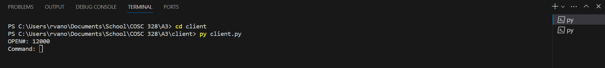
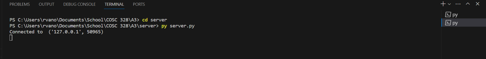
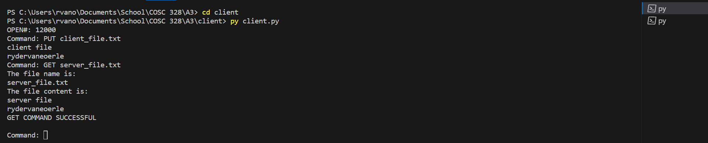
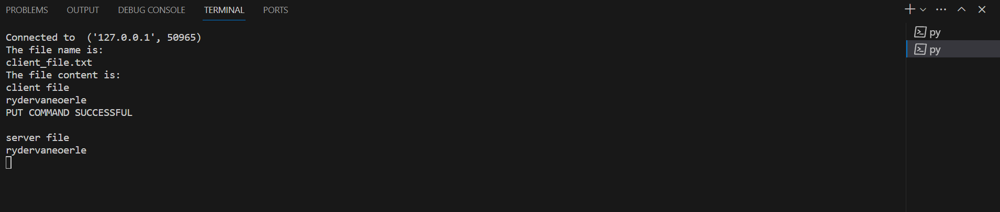

# File Transfer Protocol Server
## Description
This simple FTP server allows for 5 commands:

1. Attempts to open an FTP connection to 127.0.0.1 using the port number specified.
```
OPEN #
```
2. Requests a file from the server. This file will be loaded from the server directory, transferred by the server
to the client, and saved by the client to the same name in the client directory.
```
GET 'filename'
```
3. Sends a file to the server. This file will be loaded from the client directory, transferred by the client to the
server, and saved by the server to the same name in the server directory.
```
PUT 'filename'
```
4. This closes the current connection to the server but keeps the client running so that the client can connect
to another server if they wish to.
```
CLOSE
```
5. Exits the client, closing any open connections
```
QUIT
```


## Demo
### Initial client connection

### Initial client connection

### Post commands client-side

### Post commands server-side

